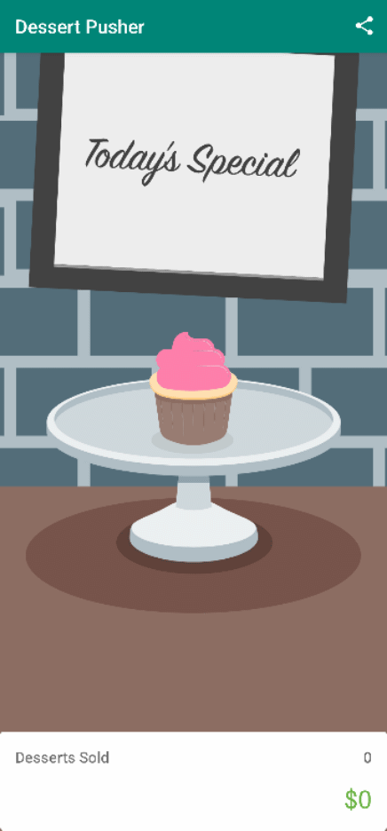

<h2 align="center">
  🔥 Dessert Pusher - An Android App to learn Logging 🔥 
  <a href="https://learn.udacity.com/courses/ud9012/lessons/a0771b3c-3d56-47ae-afc4-198bc0b74b56/concepts/a4315c5b-ef29-4a83-b732-3ffc34269dd8" target="_blank">Activity & Fragment Lifecycle | Udacity </a>
</h2>

  

 

You can fork this repo to modify and make changes of your own. Please Feel Free to send pull request with your updates [akifislam](https://github.com/akifislam). Thanks!

## Built With

This project was built using these technologies.

- Kotlin
- XML
- Android Studio

## Goal of this Project

- Learn How to Log on Android Studio using Timber

Thanks

